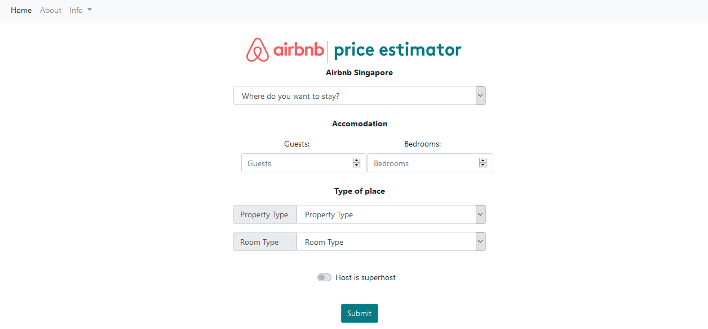
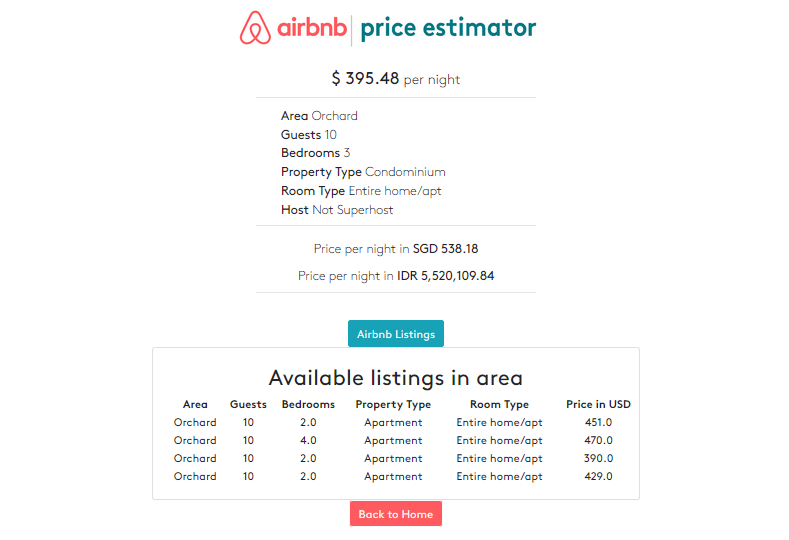

# Airbnb Singapore Price Estimator

 Airbnb is an online marketplace which lets people rent out their properties or spare rooms to guests. Airbnb operates through a C2C online marketplace model that provides a platform for people looking to rent out their homes for a duration of time. Hosts provide details of their listing in terms of price, location, availability and amenities that Airbnb that fit guests required criteria.
 
 **The main objective of this project is to provide user best price/rate per night to spent on airbnb listings in Singapore.** The dataset used in this project is provided by  [insede airbnb](insideairbnb.com), sourced from publicly available information from the Airbnb site (airbnb.com).

#

## Web App Price Estimator

This Web App provide the best price user can get from the available dataset listings from Airbnb Singapore using the Gradient Boosting Regressor model. The price estimation is depend on 6 listings features :
- Area
- Guests 
- Bedrooms
- Property Type
- Room Type
- Host (Superhost/Not)

**Home Page**

On the home page, users must filled in the required form according to users' preferences of Airbnb listings. 

**Result Page**

After fill the form, user will get a best price rate per night. Prices are available in 3 currencies (USD, SGD, IDR). Currency exchange rates sourced from https://free.currencyconverterapi.com/

